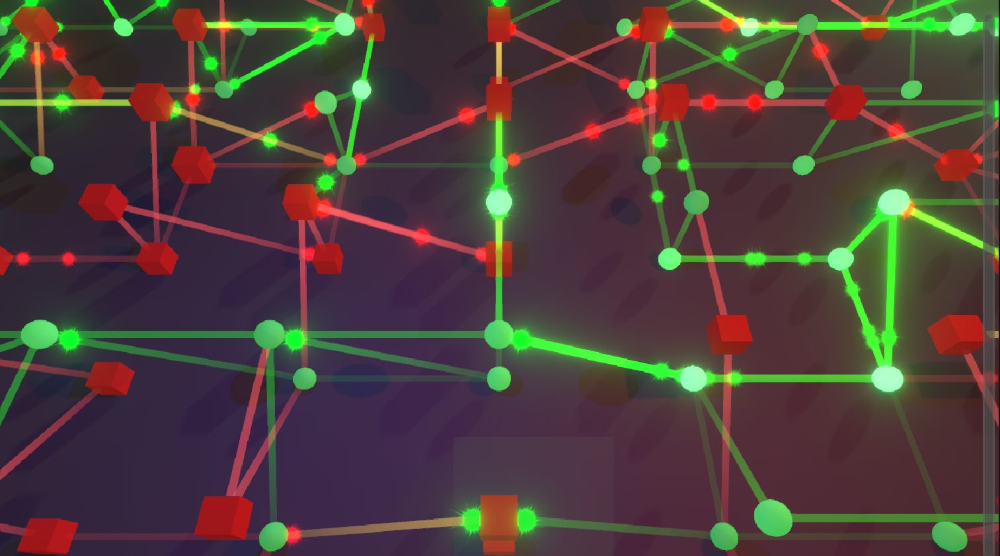

# Neuron Simulation Project

Welcome to the Neuron Simulation Project! This project simulates the activity of neurons and their connections, visualizing the neuroplasticity and interactions between neurons in real-time using Unity.



## Table of Contents
- [Introduction](#introduction)
- [Features](#features)
- [Installation](#installation)
- [Usage](#usage)
- [Contributing](#contributing)
- [License](#license)

## Introduction

This project aims to simulate the behavior of neurons using a real-time 3D environment in Unity. It provides an interactive experience where users can see how neurons communicate and change over time, demonstrating principles of neuroplasticity.

## Features

- **Real-time Visualization**: Watch neurons communicate and change their activity levels.
- **Customizable Settings**: Adjust the simulation parameters such as neuron sensitivity and connection strength.
- **Event-Driven Design**: Modular approach using events for clean and maintainable code.
- **Particle System Visualization**: Visualize neuron activity and spike paths using particles.

**Neuron Settings**


**Effect Settings**


## Installation

1. **Clone the Repository:**
    ```bash
    git clone https://github.com/yourusername/neuron-simulation.git
    ```
2. **Open in Unity:**
   - Make sure you have Unity installed.
   - Open the project in Unity by selecting the `neuron-simulation` folder.

3. **Install Dependencies:**
   - All required packages will be installed automatically when you open the project in Unity.

## Usage

1. **Run the Simulation:**
   - Open the Unity Editor and hit the `Play` button to start the simulation.
   - Observe the neuron activity and explore the visualization tools.

2. **Customize Settings:**
   - Access the `NeuronManager` to adjust simulation parameters.
   - Use the UI to start, pause, or reset the simulation.

3. **Saving and Loading:**
   - Use the save/load buttons in the UI to store and retrieve simulation states.


## Contributing

We welcome contributions! Please follow these steps:

1. Fork the repository.
2. Create a new branch (`git checkout -b feature-branch`).
3. Make your changes and commit them (`git commit -m 'Add new feature'`).
4. Push to the branch (`git push origin feature-branch`).
5. Open a pull request.

Please read our [contribution guidelines](CONTRIBUTING.md) for more details.

## License

This project is licensed under the MIT License - see the [LICENSE](LICENSE) file for details.
